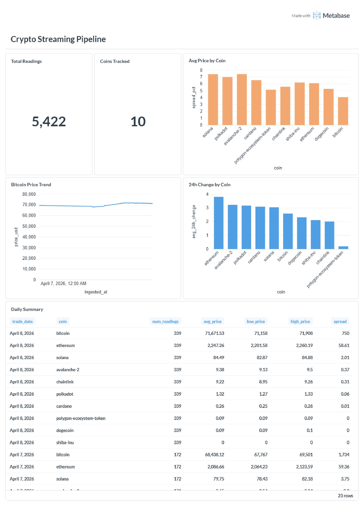
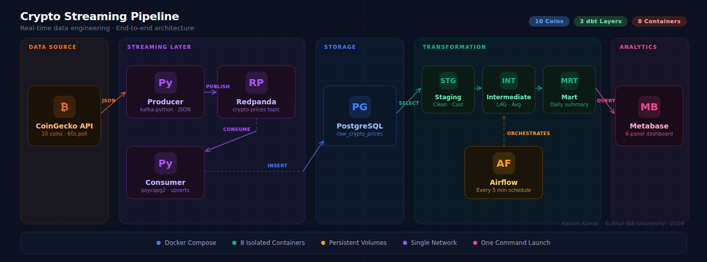
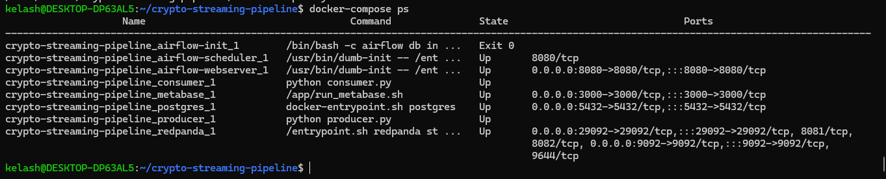
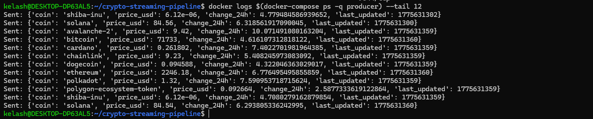
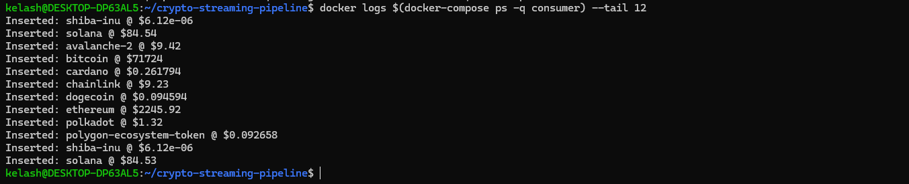
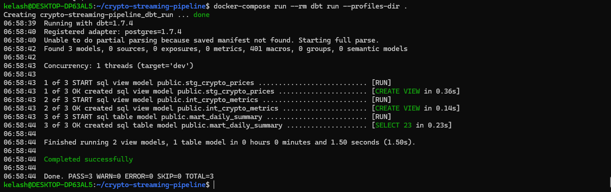
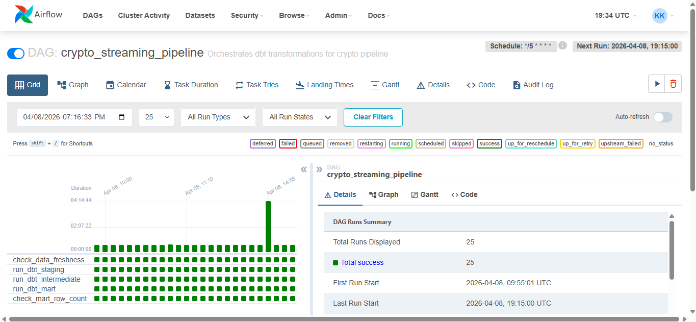
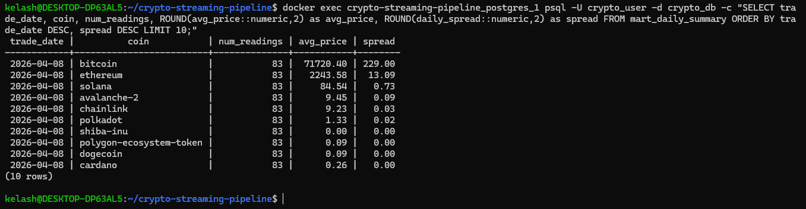

# 🚀 Crypto Streaming Pipeline

**A production-grade, end-to-end real-time data pipeline** that ingests live cryptocurrency prices for 10 coins, streams them through a Kafka-compatible message broker, transforms raw events into analytics-ready marts via dbt, and serves a live dashboard from a public HTTPS URL — fully containerised, deployed to a cloud ARM VM, with automated CI/CD on every push to `main`.

> Built as part of the **Data Engineering Accelerated Mastery** program · Jan – Apr 2026

[](https://github.com/kelashkumar-iba/crypto-streaming-pipeline/actions)
[](https://opensource.org/licenses/MIT)
[](https://www.python.org/downloads/)
[](https://docs.docker.com/compose/)

---

## 🌐 Live Demo

**🔗 [https://streaming-pipeline.kelash.me](https://streaming-pipeline.kelash.me)**

A live status page backed by data ingested in real-time from CoinGecko, surfacing throughput, freshness, container status, and dbt test results from the production pipeline. Numbers are pulled from a FastAPI `/api/stats` endpoint that queries the live Postgres warehouse — no cached demo data, no static screenshots.

The deployment runs 24/7 on an Oracle Cloud Always Free ARM VM (Mumbai region), reverse-proxied through Caddy with automatic Let's Encrypt SSL on a custom domain.

> 📩 **For recruiters:** read-only Metabase credentials available on request via [LinkedIn](https://linkedin.com/in/kelashkumar-iba). The dashboard reflects whatever the producer has ingested in the last few minutes — fully live.

---

## 📊 Live Dashboard



*Real-time Metabase dashboard showing price trends, volatility analysis, 24h performance, and daily summaries across 10 cryptocurrencies.*

---

## 🏗️ Architecture



### Data Flow

```
CoinGecko API ──► Producer ──► Redpanda (Kafka) ──► Consumer ──► PostgreSQL
                                                                      │
                                                                      ▼
                                                    dbt (staging → intermediate → mart)
                                                                      │
                          ┌───────────────────────────────────────────┴───────────────────────┐
                          ▼                                                                   ▼
                  Metabase Dashboard                                                FastAPI /api/stats
                          ▲                                                                   ▲
                          └───────────────── Caddy (HTTPS reverse proxy) ─────────────────────┘
                                                          │
                                                          ▼
                                                  🌐 Public Internet
                                          streaming-pipeline.kelash.me
```

Airflow orchestrates the dbt transformation chain on a 5-minute schedule, sitting alongside the streaming layer.

### How It Works

1. **Producer** pulls real-time prices for 10 cryptocurrencies (Bitcoin, Ethereum, Solana, Cardano, Polkadot, Chainlink, Avalanche, Polygon, Dogecoin, Shiba Inu) from the CoinGecko API every 60 seconds.
2. **Redpanda** (Kafka-compatible message broker) decouples the producer from the consumer. Messages persist in the `crypto-prices` topic, surviving consumer downtime without data loss.
3. **Consumer** reads messages from Redpanda, deserialises JSON with poison-pill protection, and inserts rows into PostgreSQL's `raw_crypto_prices` table.
4. **dbt** transforms raw data through three layers:
   - **Staging** — type casting, null filtering, unix timestamp conversion (materialised as views)
   - **Intermediate** — price changes via window functions, 5-period moving averages (views)
   - **Mart** — daily aggregations: avg/high/low price, spread, reading counts (materialised as table)
5. **Airflow** orchestrates dbt every 5 minutes: data freshness check → staging → intermediate → mart. If no fresh data has arrived, the DAG fails fast and surfaces the real issue rather than silently transforming stale data.
6. **Metabase** queries the mart layer for instant dashboards.
7. **FastAPI** exposes a lightweight `/api/stats` endpoint that the public landing page hits to render live throughput, freshness, and container counts — no JavaScript polling Metabase directly.
8. **Caddy** terminates TLS, serves the dashboard and API over HTTPS at `streaming-pipeline.kelash.me`, and auto-renews Let's Encrypt certificates every 60 days.

---

## ✅ Data Quality

The pipeline runs **14 automated dbt tests** plus **8 Python unit tests** on every CI run.

**dbt tests (run on every Airflow execution):**
- `not_null` constraints on source columns and 3 model layers
- `unique` constraints on id columns
- `accepted_values` — restricts the coin universe to 10 known IDs
- Source freshness check — DAG fails if data is older than threshold

**Python unit tests (run in CI, 0.14s):**
- `producer.build_message()` — 4 cases covering complete data, missing fields, empty values, fetch URL/params
- `consumer.safe_deserializer()` — 4 cases covering valid JSON, malformed JSON, invalid UTF-8, empty bytes

External dependencies (`kafka-python`, `psycopg2`) are mocked at the `sys.modules` level via `tests/conftest.py` — a workaround for the real-world incompatibility where `kafka-python==2.0.2` imports a vendored `six` module that breaks under Python 3.12.

---

## 🛠️ Tech Stack

| Layer | Technology | Purpose |
| --- | --- | --- |
| **Ingestion** | Python 3.11, CoinGecko API, requests | Pull real-time crypto prices |
| **Streaming** | Redpanda v23.3.6 (Kafka-compatible) | Decouple producer/consumer, message durability |
| **Storage** | PostgreSQL 14 | Persistent relational storage (app + Metabase metadata) |
| **Transformation** | dbt 1.7.4, dbt-postgres | SQL staging → intermediate → mart |
| **Orchestration** | Apache Airflow 2.8.1 (LocalExecutor) | 5-minute cadence, freshness gates |
| **Visualization** | Metabase v0.60.2.5 | Interactive analytics dashboards |
| **Stats API** | FastAPI | Live `/api/stats` endpoint feeding the public landing page |
| **Reverse Proxy** | Caddy 2 | Automatic HTTPS via Let's Encrypt (HTTP-01) |
| **Cloud Host** | Oracle Cloud (Always Free, ARM A1.Flex) | 4 OCPU / 24 GB RAM, Mumbai region |
| **Containerization** | Docker Engine + Docker Compose | All services in isolated containers |
| **CI/CD** | GitHub Actions | Lint, test, build, deploy on every push |
| **Quality** | pytest, ruff, pre-commit | 8 unit + 14 dbt tests, lint, format, secret detection |

---

## 🚀 Quick Start (Local Development)

### Prerequisites
- Docker Engine 20+ with Compose plugin
- `make` (most Linux/macOS systems have it; on Windows use WSL2)

### Launch in 3 Commands

```bash
# Clone
git clone https://github.com/kelashkumar-iba/crypto-streaming-pipeline.git
cd crypto-streaming-pipeline

# Start everything
make up

# Verify
make ps
```

All services boot in ~60 seconds. Open `http://localhost:3000` for Metabase, configure with these credentials when the wizard prompts:

| Field | Value |
| --- | --- |
| Host | `postgres` |
| Port | `5432` |
| Database | `crypto_db` |
| Username | `crypto_user` |
| Password | `crypto_pass` |

### Available Make Targets

```bash
make help        # List all available commands
make up          # Start all services
make down        # Stop all services
make ps          # Show container status
make logs        # Tail all logs
make logs SVC=producer   # Tail one service's logs
make test        # Run pytest (8 unit tests)
make lint        # Run ruff
make fmt         # Auto-format with ruff
make check       # Mirror CI: lint + format check + test
make psql        # Connect to crypto_db
make tables      # List database tables
make clean       # Stop + remove volumes (DESTRUCTIVE)
```

---

## 🌍 Production Deployment

The live deployment runs on **Oracle Cloud Always Free Tier**:

- **VM**: Ampere A1.Flex (ARM64), 4 OCPU, 24 GB RAM, Ubuntu 22.04
- **Region**: Asia South (Mumbai), AD-1
- **Domain**: Custom domain `streaming-pipeline.kelash.me` (Cloudflare DNS → VM public IP)
- **TLS**: Let's Encrypt cert via Caddy's automatic ACME flow (HTTP-01 challenge)
- **Monthly cost**: $0.00 (Always Free tier + free TLS)

### Deployment Flow

```
git push → GitHub Actions CI (parallel: lint, test, build) → CD job
                                                                 │
                                                                 ▼
                                              SSH into VM (deploy key from GitHub Secrets)
                                                                 │
                                                                 ▼
                                              git pull && docker compose up -d --build
                                                                 │
                                                                 ▼
                                              🌐 Live within ~90 seconds
```

**Push-to-live latency:** ~90 seconds (CI: 30s, deploy: 30–60s).

---

## 🔄 CI/CD Pipeline

Defined in [`.github/workflows/ci.yml`](.github/workflows/ci.yml). Four jobs run on every push and PR to `main`:

| Job | Tool | Purpose |
| --- | --- | --- |
| **lint** | `ruff check` + `ruff format --check` | Lint + style enforcement |
| **test** | `pytest` | 8 unit tests with mocked external dependencies |
| **build** | `docker build` | Validates compose YAML and Python image builds |
| **deploy** | SSH + `git pull` + `docker compose up -d --build` | Auto-deploys to Oracle VM (only on push to `main`) |

The **deploy job is gated** behind `needs: [lint, test, build]` — if any check fails, the deploy never runs. This is the safety net: broken code cannot reach production.

### CI Performance

- Total wall-clock: **~30 seconds** for lint + test + build (parallel)
- Total deploy time: **~60 seconds** for SSH + pull + container restart
- End-to-end push-to-live: **~90 seconds**

### Pre-commit Hooks

Configured in [`.pre-commit-config.yaml`](.pre-commit-config.yaml). On every `git commit`:

- `ruff` (lint + auto-fix)
- `ruff-format` (auto-format)
- `trailing-whitespace`, `end-of-file-fixer`
- `check-yaml` (validates compose files, GitHub Actions YAML)
- `detect-private-key` (prevents accidental SSH key commits)
- `check-added-large-files` (blocks files >500 KB)

If any hook fails, the commit is rejected. Bad code never reaches CI, saving runner minutes.

---

## 🔒 Security Posture

The deployment is hardened with **three independent layers** of network defense:

| Layer | Mechanism | Effect |
| --- | --- | --- |
| **Cloud edge** | Oracle Security List | Only ports 22 (SSH), 80 (HTTP), 443 (HTTPS) reachable from the internet |
| **Host firewall** | iptables (persistent) | Same allowlist enforced at the VM level |
| **Container** | Docker `expose:` (not `ports:`) | Postgres, Redpanda, Airflow, Metabase reachable only on the internal Docker network |

For an attacker to reach Metabase on port 3000 directly, they would have to bypass all three layers. Caddy is the only public ingress; everything else is internal.

### Other Security Practices

- **Default credentials rotated** — Airflow's `admin/admin` was replaced with a dedicated user during deployment.
- **Deploy SSH key isolated** — GitHub Actions uses a separate Ed25519 key pair (different from personal SSH key), stored in GitHub Secrets (encrypted at rest).
- **Local private key shredded** after upload — the deploy private key only exists in GitHub's encrypted store.
- **TLS enforced** — Caddy auto-redirects HTTP → HTTPS. HSTS header (`max-age=31536000`) sent on every response.
- **Security headers** — `X-Frame-Options: DENY`, `X-Content-Type-Options: nosniff`, `X-XSS-Protection`.

---

## 📁 Project Structure

```
crypto-streaming-pipeline/
├── .github/
│   └── workflows/
│       └── ci.yml                  # GitHub Actions CI/CD (lint/test/build/deploy)
├── airflow/
│   ├── Dockerfile
│   ├── dags/
│   │   └── crypto_pipeline_dag.py  # 5-min orchestration DAG
│   └── dbt_project/                # dbt files for Airflow container
├── consumer/
│   ├── Dockerfile
│   ├── requirements.txt
│   └── consumer.py                 # Redpanda → PostgreSQL consumer
├── dbt_crypto/
│   ├── Dockerfile
│   ├── dbt_project.yml
│   ├── profiles.yml
│   └── models/
│       ├── staging/
│       ├── intermediate/
│       └── mart/
├── producer/
│   ├── Dockerfile
│   ├── requirements.txt
│   └── producer.py                 # CoinGecko API → Redpanda producer
├── stats_api/
│   ├── Dockerfile
│   ├── requirements.txt
│   └── main.py                     # FastAPI /api/stats endpoint
├── tests/
│   ├── conftest.py                 # Module-level kafka/psycopg2 mocks
│   ├── test_producer.py            # 4 producer unit tests
│   └── test_consumer.py            # 4 consumer unit tests
├── screenshots/                    # Architecture & dashboard images
├── Caddyfile                       # Caddy reverse proxy config (HTTPS)
├── Makefile                        # Dev workflow shortcuts
├── docker-compose.yml              # Orchestrates all services
├── init-db.sh                      # Bootstraps metabase_user/db on first start
├── pyproject.toml                  # pytest + ruff + mypy config
├── requirements-dev.txt            # Dev tooling (pytest, ruff, mypy, pre-commit)
├── .pre-commit-config.yaml         # Pre-commit hooks
├── .gitignore
└── README.md
```

---

## 🔧 Engineering Decisions

### Why Redpanda over Kafka?
Redpanda speaks the exact Kafka wire protocol but runs without the JVM, consuming ~80% less memory. Critical for fitting the full stack into 24 GB RAM on a free-tier ARM VM. In production, the choice between Kafka and Redpanda is organisational — application code is identical either way.

### Why Caddy over Nginx?
Caddy ships with automatic HTTPS as the default. The entire reverse-proxy + TLS config for two domains is roughly:

```
streaming-pipeline.kelash.me {
    reverse_proxy /api/* stats_api:8000
    reverse_proxy metabase:3000
}
```

Nginx would require ~30 lines plus a separate `certbot` cron job for renewal. For a single-VM deployment, the simplicity wins. For 50-microservice production, Nginx + cert-manager would be the right call — Caddy is a tool choice, not a religion.

### Why FastAPI for live stats?
The public landing page needs to show real numbers — throughput, freshness, container counts — without giving anonymous internet visitors raw access to Metabase or Postgres. A tiny FastAPI service runs read-only SQL against the warehouse and returns clean JSON. Caddy routes `/api/*` to FastAPI and everything else to Metabase, so both share the same domain.

### Why dbt views for staging/intermediate, table for mart?
Staging and intermediate transformations are lightweight and don't need physical storage. Materialising them as views means no storage cost and always-fresh definitions. The mart layer materialises as a table because Metabase queries it repeatedly — pre-computing once at DAG runtime keeps dashboards fast.

### Why Airflow checks data freshness first?
If the producer or Redpanda is down, running dbt on stale data wastes compute and masks the real failure. The freshness check fails the DAG early and points at the actual problem: no new data is flowing.

### Why ARM (not x86)?
Oracle Always Free offers Ampere A1.Flex with 4 OCPU / 24 GB RAM at zero cost, vs x86 free tier capped at 1 OCPU / 1 GB RAM. ARM was the only viable platform for running this many containers concurrently. The tradeoff: every Docker image must have an `arm64` build — discovered late in the deployment when Metabase v0.50.x was rejected with `exec format error` (single-arch x86 tag).

### Why a custom domain over the free DNS?
The deployment was originally on a free dynamic-DNS subdomain. A `.duckdns.org` URL on a portfolio reads "hobbyist" to recruiters; `streaming-pipeline.kelash.me` reads "professional infrastructure." A 10-minute Caddyfile swap was the entire migration cost.

### Why secrets-as-plaintext in compose (for now)?
The Postgres passwords are committed in `docker-compose.yml`. This is a deliberate compromise: the database ports (5432) are blocked at three firewall layers, so the actual leak risk is essentially zero. In a real production deployment, secrets would live in a `.env` file (gitignored) or a vault system (HashiCorp Vault, AWS Secrets Manager, GitHub Secrets for CI). The README acknowledges this rather than hiding it.

### Why retry loops in Producer and Consumer?
`depends_on` in Docker Compose only waits for a container to **start**, not for the service to be **ready**. PostgreSQL and Redpanda take several seconds to accept connections after container launch. Retry loops with exponential backoff handle this gracefully without crashing.

### Why `PYTHONUNBUFFERED: "1"`?
Python buffers stdout inside Docker containers (no TTY attached). Without this flag, `docker logs` shows nothing for minutes even when code is running correctly. Hard-learned standard for Python in Docker.

---

## 🧠 What I Learned

### Real debugging stories from building this

**Python 3.12 broke `kafka-python` imports.** Locally, pytest failed to collect tests with `ModuleNotFoundError: No module named 'kafka.vendor.six.moves'`. The `kafka-python==2.0.2` library imports a vendored copy of `six` that was incompatible with Python 3.12. Fixed by mocking `kafka` and `psycopg2` at the `sys.modules` level in `conftest.py` — turning a runtime dependency into a test-time stub.

**`exec format error` on Metabase v0.50.x.** Pulled the official `metabase/metabase:v0.50.20` image to my ARM VM, container exited immediately. The image tag was tagged `multi-arch` on Docker Hub but the actual manifest only contained `linux/amd64`. Confirmed via `docker buildx imagetools inspect` showing single architecture. Solution: pin to `v0.60.2.5` which has a true multi-arch manifest. Lesson: always verify ARM images with `imagetools inspect`, never trust the tag label.

**GitHub Actions PAT needed `workflow` scope.** First attempt to push `.github/workflows/ci.yml` was rejected with `refusing to allow a Personal Access Token to create or update workflow without 'workflow' scope`. GitHub treats workflow files as elevated capability — they can run any code, access any secret. Required a fresh PAT with both `repo` and `workflow` scopes.

**Pre-commit's stash dance can fail.** When pre-commit auto-fixes files during a commit, it stashes uncommitted changes, applies hooks, then tries to restore the stash. If the auto-fix and the stashed changes overlap, you get `Stashed changes conflicted with hook auto-fixes... Rolling back fixes` and the commit aborts. Solution: run `pre-commit run --all-files` once manually, then `git add -A && git commit` so there are no unstaged files to stash.

**Three-way git sync between laptop, VM, and GitHub gets confusing.** The VM had locally modified files (Caddyfile, init-db.sh, modified docker-compose.yml) that were never pushed. The laptop was 1 commit behind GitHub. GitHub had a different latest commit than both. Resolution: SCP the VM's edits to the laptop, commit from the laptop (single source of truth from now on), push to GitHub, then `git stash --include-untracked && git pull && git stash drop` on the VM to clean its working tree. Lesson: pick one source of truth (the laptop) and never edit on the VM directly.

**CI safety net works — verified with intentional failure.** Wrote `tests/test_intentional_failure.py` with `assert 1 == 2`, pushed, watched CI go red in 19 seconds. Reverted the test, pushed, watched CI go green in 28 seconds. The deploy job never ran during the red phase — `needs: [lint, test, build]` did its job. Real evidence that the safety net catches what it should.

### Engineering concepts internalised

- **Streaming architecture fundamentals** — topics, partitions, consumer groups, offsets, why message brokers decouple producers from consumers
- **Docker multi-service orchestration** — networking, volumes, layer caching, the `PYTHONUNBUFFERED` gotcha
- **dbt transformation layers** — staging (clean) → intermediate (enrich) → mart (serve), with `ref()` building automatic dependency graphs
- **Defense in depth** — independent security layers, each enforcing the policy, so misconfiguration in one doesn't compromise the system
- **CI/CD as quality gate** — automated pipelines that block bad code from reaching production, not just notification systems
- **Production patterns** — poison pill handling, retry loops, idempotent table creation, defensive serialisation

---

## 📈 Future Improvements

- [ ] Externalise secrets to `.env` (gitignored) with `${VAR}` references in compose
- [ ] Add Great Expectations quality gates between dbt layers
- [ ] Implement dead letter queue for failed messages
- [ ] Slack/email alerting on Airflow DAG failures
- [ ] UptimeRobot monitoring → public status badge
- [ ] dbt tests in CI (`dbt test --select state:modified+`)
- [ ] Migrate to AWS (S3 + RDS + ECS) when budget allows
- [ ] Blue-green deployment for zero-downtime updates
- [ ] Add Prometheus + Grafana for application-level metrics

---

## 📸 Screenshots

### All Services Running



*All containers running simultaneously: Redpanda, PostgreSQL, Producer, Consumer, dbt, Airflow (webserver + scheduler), Metabase, FastAPI stats API, and Caddy.*

### Producer — Streaming 10 Coins



*Producer pulling live prices from CoinGecko API and publishing to Redpanda every 60 seconds.*

### Consumer — Writing to PostgreSQL



*Consumer reading from Redpanda, deserializing JSON with retry logic, and inserting into PostgreSQL.*

### dbt — Three-Layer Transformation



*dbt executing staging (view) → intermediate (view) → mart (table) in under 2 seconds.*

### Airflow — Automated Orchestration



*DAG running every 5 minutes: freshness check → staging → intermediate → mart → confirmation. All tasks green.*

### PostgreSQL — Analytics-Ready Mart



*Final mart table showing daily summaries per coin — ready for dashboard consumption.*

---

## 👤 Author

**Kelash Kumar**
BS Computer Science · Sukkur IBA University · Class of 2026

[](https://github.com/kelashkumar-iba)
[](https://linkedin.com/in/kelashkumar-iba)
[](https://kelash.me)

---

*"The compound effect of daily discipline is indistinguishable from talent."*
